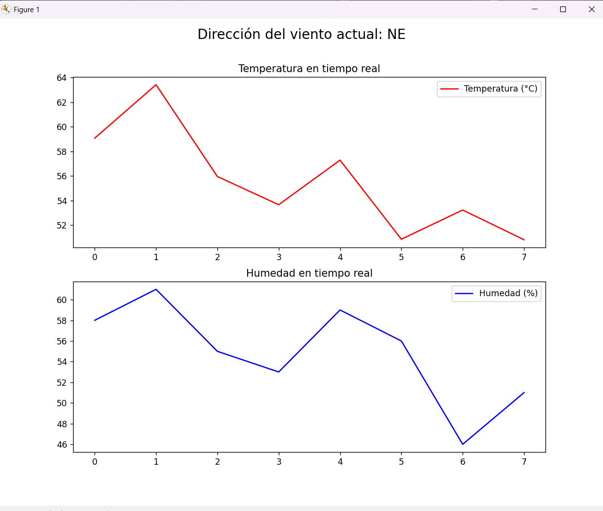

# Lab 9: IoT-Methereologic-Station
 
### Integrantes: 

- Renatto Guzmán 21646


## 🦄 Estructura

    └───.env
    └───Producer.py         # Mandar datos
    └───Consumer.py         # Recibir datos y graficar
    └───ProducerOpt.py      # Mandar datos (Optimizado)
    └───ConsumerOpt.py      # Recibir datos y graficar (Optimizado)
    └───requirements.txt    # Modulos necesarios
    └───image.png           # Imagen


## 🤖 Instrucciones

Para correr los programas se deberá tener configurado un archivo ```.env``` con los siguientes campos: 

```python

KAFKA_BOOTSTRAP_SERVERS=0.0.0.0:9092 #IP del servidor y el puerto correspondiente
KAFKA_TOPIC=21646 #Carne del estudiante

```

Luego con esto se deberán instalar las librerías utilizadas con el comando: 

```bash 
pip install -r requirements.txt
```

Luego con esto listo se pueden correr los archivos Consumer.py y Producer.py en dos terminales diferentes, pueden ser en dos dispositivos y en el Consumer.py se estarán recibiendo los mensajes que se manden a ese topic.

Puede seguir estas mismas instrucciones con ConsumeroOpt.py y ProducerOpt.py. Estos no son compatibles con los no-optimizados.

Si se desea terminar de correr un archivo se puede interruptir el proces con ```CTRL + C ```

## 🐸 Resultado 
</img>